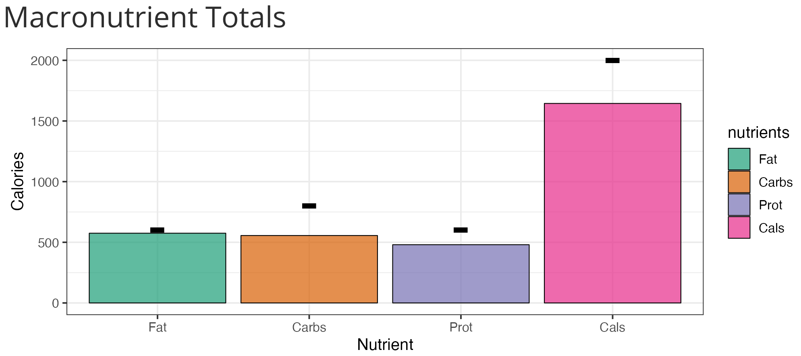
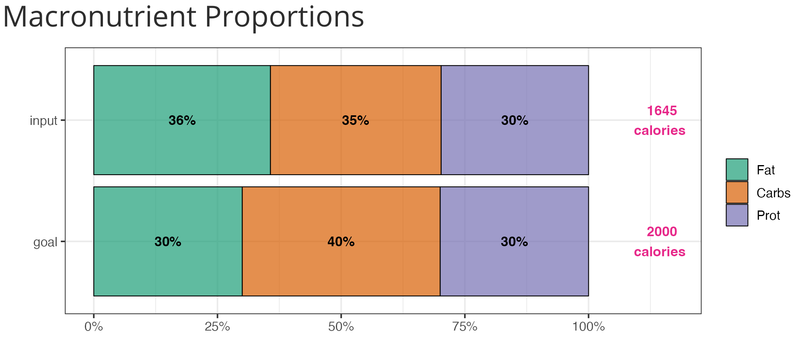

# MacroView

[](https://github.com/UBC-MDS/MacroView/actions/workflows/deploy-app.yaml)

Available at: https://macroview.shinyapps.io/MacroView/

## Group Members

-   Austin Shih @austin-shih
-   Chester Wang @ChesterAiGo
-   Jakob Thoms @J99thoms
-   Samson Bakos @samson-bakos

## Overview

This repository contains the MacroView dashboard project. The project aims to create an application that allows potential users track their daily calorie/ macronutrient intake by using the `Nutrient Value of Some Common Foods` dataset accessed [here](https://open.canada.ca/data/en/dataset/a289fd54-060c-4a96-9fcf-b1c6e706426f).


## Who are we and who should use this dashboard?

We are a team of 5 [UBC MDS](https://masterdatascience.ubc.ca/) students who created this Shiny app as part of the masters program and hope to empowering individuals to make informed and healthy lifestyle choices.

This dashboard is essentially a nutrition tracking dashboard that enables health-conscious individuals to accurately track and visualize their macronutrient intake. Our intended users are anyone who wants to track their nutrition easily, for free, and with reliable nutrition data. MacroView will be accessible for both experienced body-builders and individuals who are new to nutrition tracking and don't know where to start.

## Dashboard Functionality

The dashboard will have four tabs, `Main Dashboard`, `About`, `Data`, `Download`, and `Statistics`, with the `Main Dashboard` tab containing the main app funcionality. The `About` tab contains user information and app usage. The `Data` tab conatins explanations and links to the dataset used in the app. The `Download` tab allows the user to download the cleaned and merged dataset used in the app. Finally, the `Statistics` tab will show the user top foods containing the most per gram concentration of the selected nutrition components. The live app can be accessed [here](https://macroview.shinyapps.io/MacroView-v1/).

### Main Dashboard

The `Main Dashboard` layout will have user input on the left and visualizations on the right.


On the left hand columns there are two input categories, one for setting up macro nutrient targets either by slider bars or direct user input, and the other for inputting actual food intake items by weight to visually determine if targets are met.


Once targets and food items are populated, two graphics will be displayed to visualize targets and inputs. The top 'Totals' figure will display the user input information as a bar plot indicating total calories, and caloric breakdown by macro nutrients (protein, carbs, fat) as well as user targets.


The bottom figure will plot the specific caloric intake and targets as a stacked bar plot showing the proportional breakdown of user inputs.


If users wish to save a specific layout of the app (such as saving a meal plan for printing), they can click the Download Report button corresponding to their desired targets (sliders or manual input). PLEASE NOTE: The Download Report button is currently not working on the current version of the remote deployment of the app. It can be used by cloning the app to a local device and rendering the app locally via R. 

### Statistics

The `Statistics` layout will feature a user input panel for the user to select nutrition components for ranking, and a plot showing the top food items in the selected category.


## Continuous Development

Want to help improve this app? Please check out the [contributing guidelines](https://github.com/UBC-MDS/MacroView/blob/main/CONTRIBUTING.md) and [code of conduct](https://github.com/UBC-MDS/MacroView/blob/main/CODE_OF_CONDUCT.md).

Below are the steps to setup the development environment for MacroView:

1. Clone this repo and create a development branch
    ``` console
    $ git switch -c name-of-contributing-branch
    ```
2. Open `src` folder from the root directory which contains the `run.R`, `server.R`, and `ui.R` scripts for the app. The `Run` button on the top right hand corner will allow you to run the app if any one of these scripts are opened.

3. Start contributing! The [Mastering Shiny](https://mastering-shiny.org/) online resource is a great way to learn how to use R Shiny.


## License

Please refer to the License File [here](https://github.com/UBC-MDS/MacroView/blob/main/LICENSE)
